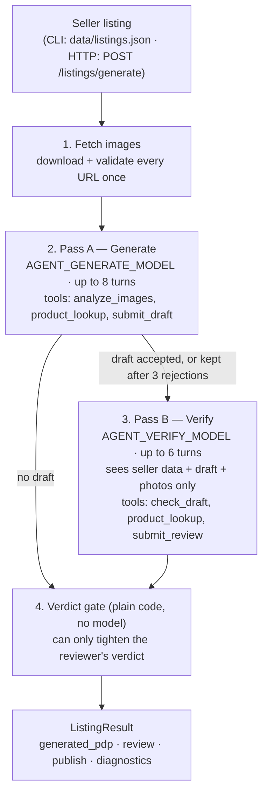

# ListingAgent

An agent that turns a raw second-hand listing — whatever the seller typed, plus their photos — into a marketplace-ready product page, then checks its own draft against the photographs and decides whether it can go live (`auto_publish`) or needs a person to look first (`human_review_needed`).

It runs two ways:

- **CLI** — reads `data/listings.json`, processes every listing, writes `output/results.json`. Needs only an OpenAI key.
- **HTTP API** — a NestJS server where a signed-in seller submits one listing; the agent's result is saved to MongoDB, and the listing is published only if the verdict is `auto_publish`. The [ListingAgent-frontend](https://github.com/Alexoswin/ListingAgent-frontend) repo is the web client for it.

The original brief is in [`Circle Assignment/README.md`](Circle%20Assignment/README.md).

## Contents

- [Quick start](#quick-start)
- [Setup](#setup)
- [Environment variables](#environment-variables)
- [Running](#running)
- [Stack](#stack)
- [How it works](#how-it-works)
- [Tools](#tools)
- [Rule checks](#rule-checks)
- [Output format](#output-format)
- [Categories and condition tiers](#categories-and-condition-tiers)
- [HTTP API](#http-api)
- [Data model](#data-model)
- [Logging](#logging)
- [File map](#file-map)
- [Tests](#tests)

## Quick start

```bash
npm install
cp .env.example .env        # set OPENAI_API_KEY — the CLI needs nothing else
npm run agent -- --input data/listings.json --output output/results.json
```

## Setup

### Requirements

| Requirement | Needed for |
|---|---|
| Node.js **22+** (the `openai` SDK requires it) and npm | everything |
| An OpenAI API key with access to a vision model and the Responses API `web_search` tool | everything |
| MongoDB | HTTP server only |
| AWS credentials with SES (sign-up OTP email) and S3 (photo uploads) | HTTP server only |

### Install

```bash
npm install
cp .env.example .env
```

Then edit `.env`:

- **CLI only:** set `OPENAI_API_KEY`. Nothing else is needed.
- **HTTP server:** also set `MONGO_URI` and the AWS values, and add `JWT_SECRET`.

`.env.example` lists only the keys you have to fill in. Every other variable in the table below has a default; add it to `.env` only to override that default. If you add one, give it a value: a line like `AGENT_VERIFY_MODEL=` sets it to an empty string, which is used as-is instead of the default.

## Environment variables

| Variable | Used by | Default | Description |
|---|---|---|---|
| `OPENAI_API_KEY` | CLI, server | — (required) | Used by both agent passes, the vision call, and the web-search product lookup. |
| `AGENT_GENERATE_MODEL` | CLI, server | `gpt-4.1-mini` | Drafting pass, plus the `analyze_images` and `product_lookup` calls. Must accept images and support OpenAI's hosted `web_search` tool. |
| `AGENT_VERIFY_MODEL` | CLI, server | `gpt-4.1` | Verification pass. Must accept images. A warning is logged at startup if it is the same as the drafting model. |
| `AGENT_CONCURRENCY` | CLI, server | `3` | How many listings the CLI processes at once. |
| `MONGO_URI` | server | `mongodb://127.0.0.1:27017/listing-agent` | MongoDB connection string. |
| `PORT` | server | `3000` | HTTP port. `.env.example` sets `6001`, which is what the frontend's `.env.example` points at. |
| `FRONTEND_URL` | server | `http://localhost:3000` | Allowed CORS origin (credentials enabled). |
| `JWT_SECRET` | server | `development-only-secret` | Signs the session JWT. Set a real secret outside local development. |
| `AUTH_COOKIE_NAME` | server | `access_token` | Name of the httpOnly session cookie. |
| `AUTH_COOKIE_MAX_AGE_MS` | server | `604800000` (7 days) | Session cookie lifetime. |
| `AWS_REGION` | server | `us-east-1` | Region for SES and S3. |
| `AWS_ACCESS_KEY_ID`, `AWS_SECRET_ACCESS_KEY` | server | — | Picked up by the AWS SDK's default credential chain. |
| `SES_FROM_EMAIL` | server | — | Sender address for sign-up OTP emails. Sign-up fails without it. |
| `AWS_S3_BUCKET` | server | — | Bucket for presigned photo uploads. `POST /uploads/s3-url` returns 400 without it. |
| `NODE_ENV` | server | — | `production` marks the session cookie `secure`. |

## Running

### CLI (batch run over a JSON file)

```bash
npm run agent -- --input data/listings.json --output output/results.json
```

| Flag | Default | Description |
|---|---|---|
| `--input` | `data/listings.json` | Array of seller listings (shape below). |
| `--output` | `output/results.json` | Where the result array is written. The directory is created if missing. |
| `--only` | all listings | Comma-separated listing ids, e.g. `--only 1,4`. |

The CLI boots a standalone Nest context with only the agent module — no database, no port, no auth. It runs through `ts-node`, so no build step is needed. When it finishes it logs how many listings were auto-published vs. escalated, and the total token usage.

Input shape (`data/listings.json` has 12 of these):

```json
{
  "listing_id": "2",
  "category": "electronics",
  "subcategory": "Laptops",
  "seller": {
    "title": "Dell 7420 7 series i7 11 generation",
    "description": "",
    "price": 42999,
    "original_price": null,
    "brand": "Dell",
    "model": "7420 7 series i7 11 generation",
    "year_purchased": "Not Available",
    "specs": { "ram": "16 GB", "storage_capacity": "512 GB", "...": "free-form" },
    "condition_details": { "condition_issues": ["No functional issues"], "...": "free-form" }
  },
  "images": ["https://.../1.jpg", "https://.../2.jpg"]
}
```

### HTTP server

```bash
npm run start:dev     # watch mode
npm run start         # single run
npm run start:debug   # watch mode with the inspector
npm run build         # compile to dist/
npm run start:prod    # run dist/main.js
```

### Other scripts

```bash
npm run lint          # eslint --fix over src/ and test/
npm run format        # prettier over src/ and test/
npm test              # unit tests
npm run test:e2e      # e2e tests (boots the full app, needs MongoDB)
npx ts-node src/scripts/seed-listings.ts   # inserts a dummy seller and 20 dummy listings (needs MONGO_URI)
```

## Stack

| | |
|---|---|
| Language | TypeScript (Node.js 22+) |
| Framework | [NestJS](https://nestjs.com/) 11 |
| Agent loop | [`@openai/agents`](https://github.com/openai/openai-agents-js) (OpenAI Agents SDK) |
| Model calls inside tools | [`openai`](https://github.com/openai/openai-node) SDK — Chat Completions for vision, Responses API for web search |
| Models | `gpt-4.1-mini` (drafting, vision, lookup) and `gpt-4.1` (verification) by default |
| Schemas | [Zod](https://zod.dev/) 4, sent to OpenAI as strict JSON Schema structured output |
| Database | MongoDB via Mongoose (HTTP server only) |
| Auth | Email + password, OTP email verification over AWS SES, JWT in an httpOnly cookie |
| Uploads | Presigned S3 PUT URLs |
| Validation | `class-validator` DTOs with a global `ValidationPipe` |

## How it works

Both entry points end up in the same function, `AgentService.runListing(listing)`, which processes one listing in four steps.



### 1. Fetch images

`ImageFetcher` downloads every image URL in parallel before either pass starts. An image is usable only if the response is a 2xx, has an `image/*` content type, is at least 2 KB, and arrives within 20 seconds. Usable images are kept as base64 data URLs and cached per URL for the life of the process. Both passes reuse the same bytes, and a URL shared by two listings is downloaded once.

Each image keeps its position in the listing's `images` array as its index. That index is how a specification cites the photo it was read from. Images that failed to load are described to the model as text ("did not load, cannot be cited") and never attached.

### 2. Pass A — Generate

A single agent (Agents SDK `Agent` + `run()`) drafts the listing. Its first message holds the seller's submission, labelled as claims rather than facts, a note on which images loaded, and per-category hints: which spec keys and condition aspects usually matter for that subcategory. The photos are not attached to this message. The model sees them by calling `analyze_images`.

The system prompt tells it to:

- call `analyze_images` first;
- call `product_lookup` for the original MRP, and to back up specs it could not read off the photos;
- give every specification a source (`image` with an image index, `lookup`, or `seller`), and drop any spec it can't source;
- separate visual condition (from the photos) from functional condition (usually the seller's word), and pick one of five tiers;
- account for **every** value in the seller's `condition_details`, copied exactly, graded as `defect` / `reassurance` / `claim` / `not_a_disclosure`, and say where each ended up in the listing;
- keep or correct the seller's category and subcategory, using only the fixed taxonomy.

It finishes by calling `submit_draft`. That tool runs the [rule checks](#rule-checks) on the draft:

- **No blocking violations** — the draft is accepted and the pass ends.
- **Blocking violations** — the draft is rejected and the list of violations goes back to the model, which fixes them and resubmits.
- **Still blocking on the third attempt** — the draft is kept with its violations attached and the pass ends. The listing will be escalated.

A pass ends only when a tool marks it finished. If the model runs out of turns, or replies in plain text without submitting, the pass counts as failed and there is no draft.

### 3. Pass B — Verify

If a draft exists, a second agent reviews it, on a different model by default. Its first message holds the seller's original submission, the draft, and the photographs themselves. It does **not** see Pass A's tool results or reasoning.

The reviewer checks each claim on its own terms:

- An `image`-sourced spec is read off the cited photo.
- A `lookup` spec is checked against the product the photos show.
- A `seller` spec is `unverifiable` unless a photo happens to confirm it.

It also checks that the seller's disclosures were graded honestly (a real defect graded as a mere "claim" counts as an omission), and whether the tier, title, MRP and category fit the evidence. It can call `check_draft` to re-run the rule checks and `product_lookup` to independently check a spec or price.

It finishes with `submit_review`: per-claim findings (`confirmed` / `contradicted` / `unverifiable`), a list of omissions, a verdict, and notes. Findings come before the verdict in the schema, so the model records its evidence before it names a verdict.

### 4. Verdict gate

`AgentService.assemble()` computes the final verdict in plain code. The listing is `human_review_needed` if **any** of these is true, and `auto_publish` only if none is:

| Escalation reason | Source |
|---|---|
| No draft was produced | Pass A failed |
| No review was produced | Pass B failed or never ran |
| Any blocking rule violation | rule checks |
| Any review finding marked `contradicted` | the reviewer's own findings |
| Any review omission | the reviewer's own findings |
| The reviewer's verdict was not `auto_publish` | the reviewer |

The reviewer can escalate a listing but cannot publish one on its own authority. A review that lists a contradicted claim but votes `auto_publish` still ends up escalated. The reasons are written to `review.escalation_reasons`.

### Failure handling

- If either pass throws (for example, an OpenAI API error), the error is logged with the pass name and stack trace, and the listing still goes through the verdict gate with whatever it has. It comes out as `human_review_needed`, so no listing is dropped.
- A tool error inside a pass (for example, a failed vision call) is logged by the tool and handed back to the model as text. It costs a turn, not the run.
- If the web search in `product_lookup` fails, the tool falls back to one model-knowledge call and tags the result as unverified. The draft then has to cite the MRP as `lookup_model_knowledge`, which raises a warning.

### Cost per listing

A listing makes up to 8 Pass A turns, one vision call, one web-search call per `product_lookup`, and up to 6 Pass B turns. Every call's token usage, including calls made inside tools, is added up in `diagnostics.usage`.

## Tools

| Tool | Pass | Arguments | What it does | Model call inside? |
|---|---|---|---|---|
| `analyze_images` | A | `listing_id` | Sends every usable photo to the drafting model (temperature 0) and returns structured observations: per-image notes (shows the product? stock/catalogue render?), brand and model text visible on the item, readable specs each marked `legible: true/false`, visible damage, and visible accessories. The result is cached for the listing, so a second call is free. If no image loaded, it says so and makes no call. | Yes — vision |
| `product_lookup` | A and B | `brand`, `model`, `category` | Finds the product's original launch price in INR and its manufacturer specs using OpenAI's hosted web search on the Responses API. At least one search is forced, results are biased to India, and the photos are attached to help pin the variant. If the search throws, it answers from model knowledge instead. The result is marked `lookup_web` only if the search returned at least one URL, otherwise `lookup_model_knowledge`. Returns up to 5 source URLs. | Yes — web search |
| `submit_draft` | A | the full draft (`pdpSchema`) | Validates the shape, runs the rule checks, then accepts, rejects (with the violation list), or keeps-and-escalates after 3 attempts. The only way Pass A ends. | No |
| `check_draft` | B | `listing_id` | Re-runs the rule checks on the draft under review and returns the summary. Takes an id rather than the draft, so the reviewer never retypes it. | No |
| `submit_review` | B | the full review (`reviewSchema`) | Validates the shape and records the review. The only way Pass B ends. | No |

Tools don't pass data to each other through the model. They read and write a shared per-listing `RunContext`: images, image analysis, lookups, draft, review, violations, token usage.

## Rule checks

`checkDraft()` in [`src/agent/draft-checker.ts`](src/agent/draft-checker.ts) is a set of plain-code comparisons against the seller input, the loaded images, and the image analysis. **Blocking** violations force `human_review_needed`. **Warnings** are recorded in the output but don't escalate on their own.

| Code | Severity | Triggered when |
|---|---|---|
| `no_draft` | blocking | There is no draft to check. |
| `no_usable_images` | blocking | None of the listing's images loaded. |
| `stock_photo` | blocking | `analyze_images` flagged an image as a catalogue render. |
| `no_specifications` | blocking | The draft has no specifications. |
| `low_confidence_spec` | warning | A spec's confidence is below 0.4. |
| `image_spec_without_index` | blocking | A spec claims an image source but names no image. |
| `spec_cites_unusable_image` | blocking | A spec cites an image that didn't load. |
| `spec_from_illegible_evidence` | blocking | A spec is read off an image, but `analyze_images` reported that detail as illegible. |
| `spec_not_corroborated_by_analysis` | warning | A spec claims an image, but `analyze_images` never reported it. |
| `title_claims_unlisted_spec` | blocking | The title contains a spec-like token (`16GB`, `14 inch`, `3 seater`, …) that no specification carries. |
| `mrp_without_source` | blocking | An MRP is given with source `none`. |
| `mrp_not_above_price` | blocking | The MRP is not above the seller's asking price. |
| `mrp_from_model_knowledge` | warning | The MRP came from model knowledge rather than a web result. |
| `unaccounted_seller_disclosure` | blocking | A value in `condition_details` has no matching `seller_disclosures` entry (exact text match). |
| `invented_seller_disclosure` | blocking | A `seller_disclosures` entry quotes text the seller never wrote. |
| `undisclosed_seller_issue` | blocking | An entry graded `defect` is marked `omitted`. |
| `tier_contradicts_visible_damage` | blocking | Tier is `Brand New` / `Like New` but the photos show damage. |
| `tier_contradicts_seller_issues` | blocking | Tier is `Brand New` / `Like New` but the seller disclosed a defect. |
| `subcategory_not_in_category` | blocking | The draft's subcategory doesn't belong to its category. |
| `category_corrected` | warning | The draft moved the listing to a different category. |
| `subcategory_corrected` | warning | The draft changed the seller's subcategory. |
| `brand_mismatch` | blocking | The brand visible in the photos doesn't match the seller's brand. |
| `description_too_short` | warning | The description is under 80 characters. |

## Output format

`output/results.json` is an array with one object per input listing, in input order. `POST /listings/generate` returns the same object plus the saved listing's `id`.

Illustrative example (trimmed; not copied from a real run):

```jsonc
{
  "listing_id": "2",
  "generated_pdp": {
    "category_reasoning": "Photos show a Dell laptop; electronics / Laptops fits.",
    "category": "electronics",
    "subcategory": "Laptops",
    "title": "Dell Latitude 7420 · Intel Core i7 11th Gen · 16GB RAM · 512GB SSD",
    "description": "Dell Latitude 7420 with an 11th-gen Core i7 … Battery health and repair history are per the seller and could not be verified from photos.",
    "original_mrp": 150000,
    "original_mrp_source": "lookup_web",
    "specifications": [
      { "key": "Brand", "value": "Dell", "source": "image", "image_index": 0, "confidence": 0.95 },
      { "key": "Processor", "value": "Intel Core i7 11th Gen", "source": "image", "image_index": 3, "confidence": 0.8 },
      { "key": "RAM", "value": "16GB", "source": "seller", "image_index": null, "confidence": 0.5 }
    ],
    "condition": {
      "tier": "Lightly Used",
      "visual_condition": "Light wear on the palm rest; lid and screen intact.",
      "functional_condition": "Seller reports no functional issues; not verifiable from photos.",
      "reasoning": "Visible handling wear rules out Like New; no damage that would suggest Regularly Used."
    },
    "unverifiable_claims": ["Battery health: Good (3-5 hours on a full charge)"],
    "seller_disclosures": [
      { "source_text": "No functional issues", "kind": "reassurance", "addressed_in": "condition" },
      { "source_text": "Original Charger Available", "kind": "claim", "addressed_in": "description" }
    ]
  },
  "review": {
    "verdict": "human_review_needed",
    "findings": [
      { "claim": "Processor: Intel Core i7 11th Gen", "claimed_source": "image", "status": "confirmed", "note": "Sticker legible in image 3." },
      { "claim": "RAM: 16GB", "claimed_source": "seller", "status": "unverifiable", "note": "Not visible in any photo." }
    ],
    "omissions": [],
    "notes": "Specs are sourced and the tier matches the photos, but …",
    "rule_violations": [
      { "code": "spec_not_corroborated_by_analysis", "severity": "warning", "message": "…" }
    ],
    "escalation_reasons": []
  },
  "publish": false,
  "diagnostics": {
    "images_submitted": 7,
    "images_loaded": 7,
    "models": "gpt-4.1-mini → gpt-4.1",
    "decorrelated": true,
    "usage": { "inputTokens": 0, "outputTokens": 0 }
  }
}
```

### `generated_pdp` — the listing

`null` if Pass A produced no draft.

| Field | Description |
|---|---|
| `category_reasoning` | What the photos show the item is, and why it belongs in the chosen category. |
| `category`, `subcategory` | The agent's classification, from the fixed [taxonomy](#categories-and-condition-tiers). May correct the seller's choice. `subcategory` is `null` only if none fits. |
| `title` | May mention only attributes that are also in `specifications`. |
| `description` | What is known, and what could not be verified. |
| `original_mrp` | Launch price when new, in INR, from `product_lookup`. `null` if no reasonable value was found. Never the asking price. |
| `original_mrp_source` | `lookup_web`, `lookup_model_knowledge`, or `none` (when `original_mrp` is `null`). |
| `specifications[]` | `key`, `value`, `source` (`image` / `lookup` / `seller`), `image_index` (required when `source` is `image`, otherwise `null`), `confidence` (0–1). |
| `condition` | `tier`, `visual_condition`, `functional_condition`, `reasoning`. |
| `unverifiable_claims[]` | Seller claims kept in the listing that nothing could confirm (battery health, repair history, bill). |
| `seller_disclosures[]` | One entry per value in the seller's `condition_details`: `source_text` (verbatim), `kind` (`defect` / `reassurance` / `claim` / `not_a_disclosure`), `addressed_in` (`description` / `condition` / `unverifiable_claims` / `omitted`). |

### `review` — the verification result

| Field | Description |
|---|---|
| `verdict` | `auto_publish` or `human_review_needed`, as decided by the [verdict gate](#4-verdict-gate). |
| `findings[]` | The reviewer's per-claim checks: `claim`, `claimed_source` (`image` / `lookup` / `seller` / `unstated`), `status` (`confirmed` / `contradicted` / `unverifiable`), `note`. |
| `omissions[]` | Defects the seller disclosed, or the photos show, that the draft leaves out. |
| `notes` | The reviewer's short rationale, or `"Verification did not complete."` if there was no review. |
| `rule_violations[]` | Output of the rule checks on the final draft: `code`, `severity`, `message`. |
| `escalation_reasons[]` | Why the gate escalated, e.g. `"Blocking rule violations: stock_photo."`. Empty when the only reason is the reviewer's own verdict. |

### `publish` and `diagnostics`

- `publish` is `true` only when the verdict is `auto_publish`. The HTTP flow stores it as `Listing.publish`.
- `diagnostics` records the images submitted and loaded, the two models used (`generate → verify`), whether they differ (`decorrelated`), and the total input/output tokens for the listing.

## Categories and condition tiers

The taxonomy is a strict enum in [`src/listings/enums/category.enum.ts`](src/listings/enums/category.enum.ts), shared by the agent's schema, the HTTP DTOs, and the Mongo schema. There is no catch-all bucket.

| Category | Subcategories |
|---|---|
| `electronics` | Laptops, Phones, Headphones, Other Tech |
| `furniture` | Sofas, Beds, Wardrobes, Coffee Tables, Home Decor |
| `home-appliances` | Fridges, Air Coolers |

Condition tiers, from best to worst: `Brand New`, `Like New`, `Lightly Used`, `Regularly Used`, `Needs Repair`.

## HTTP API

Request bodies are validated with `class-validator`. Unknown fields are rejected, and a `subcategory` must belong to its `category`. "Auth" routes need the session cookie set by `/auth/verify-otp` or `/auth/login`.

| Method | Path | Auth | Description |
|---|---|---|---|
| `GET` | `/` | | Health check. |
| `POST` | `/auth/signup` | | `{ fullName, email, password }`. Creates an unverified account and emails a 6-digit OTP (valid 10 minutes) via SES. |
| `POST` | `/auth/verify-otp` | | `{ email, otp }`. Verifies the email and sets the session cookie. |
| `POST` | `/auth/login` | | `{ email, password }`. Sets the session cookie (verified, active accounts only). |
| `POST` | `/auth/logout` | | Clears the session cookie. |
| `GET` | `/auth/me` | ✓ | The signed-in user. |
| `POST` | `/uploads/s3-url` | ✓ | `{ fileName, contentType }` → `{ uploadUrl, s3Url, key }`. A presigned S3 PUT URL, valid 5 minutes. |
| `POST` | `/listings/generate` | ✓ | Runs the agent on one submission and saves the result (see below). |
| `POST` | `/listings` | ✓ | Creates a listing manually, without the agent. |
| `GET` | `/listings` | | Paginated listings with a cover image. Query: `page` (default 1), `limit` (default 6, max 50), `category`. |
| `GET` | `/listings/:id` | | One listing with all of its image URLs in upload order. |

### `POST /listings/generate`

Body — the same fields a seller fills in, with photos required:

```json
{
  "title": "Dell 7420 i7 11th gen",
  "desc": "",
  "price": 42999,
  "originalPrice": null,
  "brand": "Dell",
  "model": "7420",
  "yearPurchased": "2022",
  "specs": { "ram": "16 GB" },
  "conditionDetails": { "condition_issues": ["No functional issues"] },
  "category": "electronics",
  "subcategory": "Laptops",
  "imageUrls": ["https://<bucket>.s3.<region>.amazonaws.com/listings/<uuid>.jpg"]
}
```

`imageUrls` takes 1–10 URLs, usually the `s3Url`s returned by `/uploads/s3-url`. The server runs `runListing()` and then:

- **If there is no draft**, it responds `503` and saves nothing.
- **Otherwise** it saves a `Listing` with the agent's title, description, MRP (as `originalPrice`), specs (flattened to `key → value`), condition plus unverifiable claims (as `conditionDetails`), and the agent's category and subcategory. It saves one `Image` document per URL and sets `publish` from the verdict.

The response is `{ id, ...ListingResult }`. A listing the agent couldn't vouch for is saved but stays unpublished.

## Data model

MongoDB collections (Mongoose schemas, all with `createdAt` / `updatedAt`):

| Collection | Schema | Holds |
|---|---|---|
| `users` | [`user.schema.ts`](src/users/schemas/user.schema.ts) | Name, email, bcrypt password hash, OTP hash and expiry, `emailVerified`, `role` (`admin` / `buyer` / `reviewer` / `seller`), `isActive`. |
| `listings` | [`listing.schema.ts`](src/listings/schemas/listing.schema.ts) | Seller, title, description, price, original price, brand, model, year, free-form `specs` and `conditionDetails`, category, subcategory, `publish`. |
| `images` | [`image.schema.ts`](src/images/schemas/image.schema.ts) | Listing reference, `s3Url`, `sequenceNo` (unique per listing), `humanVerification` / `aiVerification` flags. |
| `reviews` | [`review.schema.ts`](src/reviews/schemas/review.schema.ts) | Listing, reviewer, verdict, notes. The schema is defined, but no endpoint writes to it yet. |

## Logging

Every step logs through Nest's `Logger`, and every line includes the listing id, so `grep` on one id follows a listing through both passes. `LOG` means the step worked. `WARN` means the cautious path was taken: a rejected draft, an MRP from model knowledge, an unusable image, or an escalation. `ERROR` means something broke: a failed model call, a pass that hit its turn limit, or no draft at all.

| Logger | Logs |
|---|---|
| `AgentService` | Listing started, images loaded, final verdict with time and tokens; escalation reasons; pass failures with stack traces. |
| `AgentRunner` | Each pass's start (with model) and finish (with time and tokens); turn-limit and no-submit failures. |
| `AgentTools` | What each tool did: what the vision call saw, lookup query and result, draft accepted or rejected (with violation codes), review verdict and counts. |
| `ImageFetcher` | Each unusable image and why. |
| `ListingsService` | HTTP generate requests, and whether the listing was saved as published or held. |
| `RunAgent` (CLI) | Listing count and models at start; publish/escalate totals and token usage at the end. |

## File map

```
.
├── src/
│   ├── agent/                      # the agent — no database dependency
│   │   ├── agent.service.ts        # runListing(): fetch images → Pass A → Pass B → verdict gate; run(): concurrency pool
│   │   ├── agent-runner.ts         # runPass(): one Agents SDK run with the "a tool must finish it" exit rule
│   │   ├── tools.ts                # analyze_images, product_lookup, submit_draft, check_draft, submit_review
│   │   ├── draft-checker.ts        # checkDraft(): the rule checks
│   │   ├── schemas.ts              # Zod schemas: image analysis, lookup, draft (pdpSchema), review
│   │   ├── types.ts                # SellerListing, RunContext, Violation, image-part helpers
│   │   ├── image-fetcher.ts        # downloads, validates, and caches listing images
│   │   ├── agent.config.ts         # resolves models and concurrency from env
│   │   ├── agent.module.ts
│   │   └── prompts/
│   │       ├── pass-prompts.ts         # system prompts and first messages for both passes
│   │       └── category-spec-hints.ts  # per-subcategory spec keys and condition aspects to look for
│   ├── llm/
│   │   ├── llm.service.ts          # generateObject() (Chat Completions) and generateObjectWithWebSearch() (Responses API)
│   │   ├── json-schema.ts          # Zod → strict JSON Schema, and parsing the reply back
│   │   └── llm.types.ts
│   ├── listings/                   # listing controller, service (incl. the agent-backed generate flow), DTOs, schema, category enum
│   ├── auth/                       # signup / OTP / login / logout, JWT cookie guard
│   ├── uploads/                    # presigned S3 upload URLs
│   ├── users/  images/  reviews/   # Mongoose schemas and modules
│   ├── scripts/
│   │   ├── run-agent.ts            # CLI entrypoint (npm run agent)
│   │   └── seed-listings.ts        # dummy data for the marketplace UI
│   ├── app.module.ts               # HTTP app wiring (config, Mongo, feature modules)
│   └── main.ts                     # HTTP bootstrap: cookies, CORS, validation pipe
├── data/listings.json              # the 12 seller listings
├── examples/                       # sample input and output from the brief
├── output/                         # results.json is written here by the CLI; transcript.json is from an earlier version of the loop
├── Circle Assignment/              # the original brief, with its own copy of data/ and examples/
├── test/                           # e2e test config and spec
└── .env.example
```

## Tests

The only tests so far are the NestJS scaffold's: a unit test for `AppController` and an e2e test that boots the full app. The agent itself has no automated tests. Run it on a few listings with `npm run agent -- --only 1,4` and read the output and logs.
