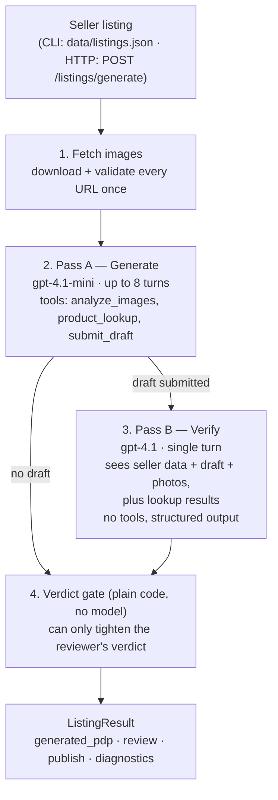

# ListingAgent

An agent that turns a raw second-hand listing — whatever the seller typed, plus their photos — into a marketplace-ready product page, then checks its own draft against the photographs and decides whether it can go live (`auto_publish`) or needs a person to look first (`human_review_needed`).

It runs two ways:

- **CLI** — reads `data/listings.json`, processes every listing, writes `output/results.json`. Needs only an OpenAI key.
- **HTTP API** — a NestJS server where a signed-in seller submits one listing; the agent's result is saved to MongoDB, and the listing is published only if the verdict is `auto_publish`. The [ListingAgent-frontend](https://github.com/Alexoswin/ListingAgent-frontend) repo is the web client for it.

The original brief is in [`Circle Assignment/README.md`](Circle%20Assignment/README.md).

## Contents

- [Quick start](#quick-start)
- [Setup](#setup)
- [Environment variables](#environment-variables)
- [Running](#running)
- [Stack](#stack)
- [How it works](#how-it-works)
- [Tools](#tools)
- [Output format](#output-format)
- [Categories and condition tiers](#categories-and-condition-tiers)
- [HTTP API](#http-api)
- [Data model](#data-model)
- [Logging](#logging)
- [File map](#file-map)
- [Tests](#tests)

## Quick start

```bash
npm install
cp .env.example .env        # set OPENAI_API_KEY — the CLI needs nothing else
npm run agent -- --input data/listings.json --output output/results.json
```

## Setup

### Requirements

| Requirement | Needed for |
|---|---|
| Node.js **22+** (the `openai` SDK requires it) and npm | everything |
| An OpenAI API key with access to a vision model and the Responses API `web_search` tool | everything |
| MongoDB | HTTP server only |
| AWS credentials with SES (sign-up OTP email) and S3 (photo uploads) | HTTP server only |

### Install

```bash
npm install
cp .env.example .env
```

Then edit `.env`:

- **CLI only:** set `OPENAI_API_KEY`. Nothing else is needed.
- **HTTP server:** also set `MONGO_URI` and the AWS values, and add `JWT_SECRET`.

`.env.example` lists only the keys you have to fill in. Every other variable in the table below has a default; add it to `.env` only to override that default. If you add one, give it a value: a line like `JWT_SECRET=` sets it to an empty string, which is used as-is instead of the default.

The models are not env vars. They are constants in [`agent.config.ts`](src/agent/agent.config.ts): `gpt-4.1-mini` for drafting (plus the `analyze_images` and `product_lookup` calls, so it must accept images and support OpenAI's hosted `web_search` tool) and `gpt-4.1` for verification (must accept images).

## Environment variables

| Variable | Used by | Default | Description |
|---|---|---|---|
| `OPENAI_API_KEY` | CLI, server | — (required) | Used by both agent passes, the vision call, and the web-search product lookup. |
| `AGENT_CONCURRENCY` | CLI, server | `3` | How many listings the CLI processes at once. |
| `MONGO_URI` | server | `mongodb://127.0.0.1:27017/listing-agent` | MongoDB connection string. Also backs the product lookup cache. |
| `PORT` | server | `3000` | HTTP port. `.env.example` sets `6001`, which is what the frontend's `.env.example` points at. |
| `FRONTEND_URL` | server | `http://localhost:3000` | Allowed CORS origin (credentials enabled). |
| `JWT_SECRET` | server | `development-only-secret` | Signs the session JWT. Set a real secret outside local development. |
| `AUTH_COOKIE_NAME` | server | `access_token` | Name of the httpOnly session cookie. |
| `AUTH_COOKIE_MAX_AGE_MS` | server | `604800000` (7 days) | Session cookie lifetime. |
| `AWS_REGION` | server | `us-east-1` | Region for SES and S3. |
| `AWS_ACCESS_KEY_ID`, `AWS_SECRET_ACCESS_KEY` | server | — | Picked up by the AWS SDK's default credential chain. |
| `SES_FROM_EMAIL` | server | — | Sender address for sign-up OTP emails. Sign-up fails without it. |
| `AWS_S3_BUCKET` | server | — | Bucket for presigned photo uploads. `POST /uploads/s3-url` returns 400 without it. |
| `NODE_ENV` | server | — | `production` marks the session cookie `secure`. |

## Running

### CLI (batch run over a JSON file)

```bash
npm run agent -- --input data/listings.json --output output/results.json
```

| Flag | Default | Description |
|---|---|---|
| `--input` | `data/listings.json` | Array of seller listings (shape below). |
| `--output` | `output/results.json` | Where the result array is written. The directory is created if missing. |
| `--only` | all listings | Comma-separated listing ids, e.g. `--only 1,4`. |

The CLI boots a standalone Nest context with only the agent module — no database, no port, no auth. It runs through `ts-node`, so no build step is needed. When it finishes it logs how many listings were auto-published vs. escalated, and the total token usage.

Input shape (`data/listings.json` has 12 of these):

```json
{
  "listing_id": "2",
  "category": "electronics",
  "subcategory": "Laptops",
  "seller": {
    "title": "Dell 7420 7 series i7 11 generation",
    "description": "",
    "price": 42999,
    "original_price": null,
    "brand": "Dell",
    "model": "7420 7 series i7 11 generation",
    "year_purchased": "Not Available",
    "specs": { "ram": "16 GB", "storage_capacity": "512 GB", "...": "free-form" },
    "condition_details": { "condition_issues": ["No functional issues"], "...": "free-form" }
  },
  "images": ["https://.../1.jpg", "https://.../2.jpg"]
}
```

### HTTP server

```bash
npm run start:dev     # watch mode
npm run start         # single run
npm run start:debug   # watch mode with the inspector
npm run build         # compile to dist/
npm run start:prod    # run dist/main.js
```

### Other scripts

```bash
npm run lint          # eslint --fix over src/ and test/
npm run format        # prettier over src/ and test/
npm test              # unit tests
npm run test:e2e      # e2e tests (boots the full app, needs MongoDB)
npx ts-node src/scripts/seed-listings.ts   # inserts a dummy seller and 20 dummy listings (needs MONGO_URI)
```

## Stack

| | |
|---|---|
| Language | TypeScript (Node.js 22+) |
| Framework | [NestJS](https://nestjs.com/) 11 |
| Agent loop | [`@openai/agents`](https://github.com/openai/openai-agents-js) (OpenAI Agents SDK) |
| Model calls inside tools | [`openai`](https://github.com/openai/openai-node) SDK — Chat Completions for vision, Responses API for web search |
| Models | `gpt-4.1-mini` (drafting, vision, lookup) and `gpt-4.1` (verification), set in [`agent.config.ts`](src/agent/agent.config.ts) |
| Schemas | [Zod](https://zod.dev/) 4, sent to OpenAI as strict JSON Schema structured output |
| Images | [sharp](https://sharp.pixelplumbing.com/), to shrink photos before they reach a model |
| Database | MongoDB via Mongoose (HTTP server only) |
| Auth | Email + password, OTP email verification over AWS SES, JWT in an httpOnly cookie |
| Uploads | Presigned S3 PUT URLs |
| Validation | `class-validator` DTOs with a global `ValidationPipe` |

## How it works

Both entry points end up in the same function, `AgentService.runListing(listing)`, which processes one listing in four steps.


```mermaid
flowchart TD
    IN["Seller listing<br/>(CLI: data/listings.json · HTTP: POST /listings/generate)"] --> FETCH
    FETCH["1. Fetch images<br/>download + validate every URL once"] --> A
    A["2. Pass A — Generate<br/>gpt-4.1-mini · up to 8 turns<br/>tools: analyze_images, product_lookup, submit_draft"]
    A -->|draft submitted| B
    A -->|no draft| GATE
    B["3. Pass B — Verify<br/>gpt-4.1 · single turn<br/>sees seller data + draft + photos,<br/>plus lookup results<br/>no tools, structured output"]
    B --> GATE
    GATE["4. Verdict gate (plain code, no model)<br/>can only tighten the reviewer's verdict"]
    GATE --> OUT["ListingResult<br/>generated_pdp · review · publish · diagnostics"]
```

### 1. Fetch images

`ImageFetcher` downloads every image URL in parallel before either pass starts. An image is usable only if the response is a 2xx, has an `image/*` content type, is at least 2 KB, and arrives within 20 seconds. Usable images are kept as base64 data URLs and cached per URL for the life of the process. Both passes reuse the same bytes, and a URL shared by two listings is downloaded once.

A photo whose longest edge is over **1536 px** is scaled down to fit, once, with [sharp](https://sharp.pixelplumbing.com/):

- It is re-encoded as JPEG at quality 90.
- EXIF orientation is applied first, so phone photos don't come out sideways.
- Transparency is flattened onto white.

A photo already within bounds is sent exactly as it came. A photo sharp can't decode is also sent as-is, with a warning in the log.

Why 1536 px:

- **It roughly halves image tokens on the drafting model.** gpt-4.1-mini charges for an image by its pixel area. Measured on real listing photos, a full-size phone photo costs 3,600–5,000 tokens there and 2,100–2,800 at 1536 px.
- **The verifier loses nothing.** gpt-4.1 scales every image to 768 px on its short side before reading it, so it gets the same pixels and the same token count at 1536 px as at full size.
- **The drafting pass still reads labels at a higher resolution than the pass that checks them.**

Each image keeps its position in the listing's `images` array as its index. That index is how a specification cites the photo it was read from. Images that failed to load are described to the model as text ("did not load, cannot be cited") and never attached.

### 2. Pass A — Generate

A single agent (Agents SDK `Agent` + `run()`) drafts the listing. Its first message holds the seller's submission, labelled as claims rather than facts, a note on which images loaded, and per-category hints: which spec keys and condition aspects usually matter for that subcategory. The photos are not attached to this message. The model sees them by calling `analyze_images`.

The system prompt tells it to:

- call `analyze_images` first;
- call `product_lookup` for the original MRP, and to back up specs it could not read off the photos;
- give every specification a source (`image` with an image index, `lookup`, or `seller`), and drop any spec it can't source;
- separate visual condition (from the photos) from functional condition (usually the seller's word), and pick one of five tiers;
- account for **every** value in the seller's `condition_details`, copied exactly, graded as `defect` / `reassurance` / `claim` / `not_a_disclosure`, and say where each ended up in the listing;
- keep or correct the seller's category and subcategory, using only the fixed taxonomy.

It finishes by calling `submit_draft`. That tool checks only the draft's shape: a draft that doesn't match the schema goes back to the model to resubmit, and a well-formed one is stored and ends the pass. Checking what the draft says is Pass B's job.

A pass ends only when a tool marks it finished. If the model runs out of turns, or replies in plain text without submitting, the pass counts as failed and there is no draft.

### 3. Pass B — Verify

If a draft exists, a second agent reviews it, on a different model. Its first message holds:

- the seller's original submission;
- the draft;
- what `product_lookup` returned in Pass A: the matched product, MRP, and whether it came from the web or model knowledge;
- the photographs themselves.

It does **not** see Pass A's reasoning, or what `analyze_images` concluded about the photos. The lookup results are what a search returned rather than what the drafting model made of them, so they don't undo that separation.

The reviewer checks each claim on its own terms:

- An `image`-sourced spec is read off the cited photo.
- A `lookup` spec is checked against the product the photos show.
- A `seller` spec is `unverifiable` unless a photo happens to confirm it.

It also checks:

- that every value in the seller's `condition_details` has a disclosure entry, copied exactly and graded honestly (a real defect graded as a mere "claim" counts as an omission);
- that every fact the description asserts traces to a photo, a lookup result or a seller field, and that seller claims are worded as the seller's rather than as fact;
- that `functional_condition` doesn't state as fact what the photos can't show — a working condition that rests on the seller must be worded as the seller's;
- that every photo shows the actual unit rather than a catalogue image, and every image the draft cites actually loaded;
- whether the tier, title, MRP and category fit the evidence, and the subcategory belongs to the chosen category.

It has no tools: it answers in a single turn, and its final message is validated against `reviewSchema` by the Agents SDK. If that message fails the schema, or the model refuses, the pass produces no review and the listing escalates. It runs at temperature 0, so the same draft and photos get the same review as far as the API allows; the drafting pass runs at 0.2. The review holds per-claim findings (`confirmed` / `contradicted` / `unverifiable`), a list of omissions, a verdict, and notes. Findings come before the verdict in the schema, so the model records its evidence before it names a verdict.

The reviewer does not run its own web search. Its MRP check rests on Pass A's lookup results, which are in its brief along with whether each came from the web or model knowledge.

### 4. Verdict gate

`AgentService.assemble()` computes the final verdict in plain code. The listing is `human_review_needed` if **any** of these is true, and `auto_publish` only if none is:

| Escalation reason | Source |
|---|---|
| No draft was produced | Pass A failed |
| No review was produced | Pass B failed or never ran |
| Any review finding marked `contradicted` | the reviewer's own findings |
| Any review omission | the reviewer's own findings |
| The reviewer's verdict was not `auto_publish` | the reviewer |

The reviewer can escalate a listing but cannot publish one on its own authority. A review that lists a contradicted claim but votes `auto_publish` still ends up escalated. The reasons are written to `review.escalation_reasons`.

### Failure handling

- If either pass throws (for example, an OpenAI API error), the error is logged with the pass name and stack trace, and the listing still goes through the verdict gate with whatever it has. It comes out as `human_review_needed`, so no listing is dropped.
- A tool error inside a pass (for example, a failed vision call) is logged by the tool and handed back to the model as text. It costs a turn, not the run.
- If the web search in `product_lookup` fails, the tool falls back to one model-knowledge call and tags the result as unverified. The draft then has to cite the MRP as `lookup_model_knowledge`, and the reviewer's brief says the price is unverified.
- If the lookup cache's database can't be read or written, the failure is logged as a warning and the lookup runs a normal search.

### Cost per listing

A listing makes up to 8 Pass A turns, one vision call, at most one web-search call per distinct `product_lookup`, and usually a single Pass B turn (3 at most). Every call's token usage, including calls made inside tools, is added up in `diagnostics.usage`. Per-pass figures are in `diagnostics.stages`, where a tool's calls count toward the pass that called it.

Token counts are not cost. At OpenAI's list prices gpt-4.1 costs five times as much per token as gpt-4.1-mini, so a few thousand Pass B tokens can cost more than all of Pass A. Web search is also billed per call, on top of its tokens.

Images are the largest input cost, so the agent is careful about where they go:

| Call | Photos attached? |
|---|---|
| Pass A turns | No. Pass A sees the photos only through `analyze_images`. |
| `analyze_images` | Yes, at up to 1536 px, since reading spec labels is the point. Runs once per listing and is cached after that. On gpt-4.1-mini this is usually the largest single call: about 2,100–2,800 tokens per photo. |
| `product_lookup` | Only when `analyze_images` could read neither a brand nor model text off the item. Otherwise it gets the analysis as text. |
| Pass B | Yes, once, in its first message. |

Pass B has no tools because the Agents SDK re-sends the whole conversation, photos included, on every turn. Each tool call would have paid for every photo again, on the more expensive model.

**Lookup cache.** `product_lookup` results are cached by brand, model and category. The key ignores case, punctuation and spacing, so `ASUS TUF-Gaming F15` and `asus tuf gaming f15` share an entry. A repeat product costs no model call and no search.

- The HTTP server stores entries in MongoDB for 30 days.
- The CLI keeps them in memory for the run.
- Only web-grounded answers are cached. A model-knowledge fallback means the search failed, so the next listing of that product tries again.

## Tools

| Tool | Pass | Arguments | What it does | Model call inside? |
|---|---|---|---|---|
| `analyze_images` | A | `listing_id` | Sends every usable photo to the drafting model (temperature 0) and returns structured observations: per-image notes (shows the product? stock/catalogue render?), brand and model text visible on the item, readable specs each marked `legible: true/false`, visible damage, and visible accessories. The result is cached for the listing, so a second call is free. If no image loaded, it says so and makes no call. | Yes — vision |
| `product_lookup` | A | `brand`, `model`, `category` | Finds the product's original launch price in INR and its manufacturer specs. Checks the [lookup cache](#cost-per-listing) first and returns a cached answer without any model call. Otherwise it uses OpenAI's hosted web search on the Responses API. At least one search is forced, and results are biased to India. The search gets what `analyze_images` read legibly (brand, model text, readable details, accessories) as text. The photos are attached only when nothing identifying was legible. If the search throws, it answers from model knowledge instead. The result is marked `lookup_web` only if the search returned at least one URL, otherwise `lookup_model_knowledge`. Returns up to 5 source URLs. | Yes — web search, unless cached |
| `submit_draft` | A | the full draft (`pdpSchema`) | Validates the draft's shape and stores it; a malformed draft goes back to the model. The only way Pass A ends. | No |

Tools don't pass data to each other through the model. They read and write a shared per-listing `RunContext`: images, image analysis, lookups, draft, review, token usage.

## Output format

`output/results.json` is an array with one object per input listing, in input order. `POST /listings/generate` returns the same object plus the saved listing's `id`.

Illustrative example (trimmed; not copied from a real run):

```jsonc
{
  "listing_id": "2",
  "generated_pdp": {
    "category_reasoning": "Photos show a Dell laptop; electronics / Laptops fits.",
    "category": "electronics",
    "subcategory": "Laptops",
    "title": "Dell Latitude 7420 · Intel Core i7 11th Gen · 16GB RAM · 512GB SSD",
    "description": "Dell Latitude 7420 with an 11th-gen Core i7 … Battery health and repair history are per the seller and could not be verified from photos.",
    "original_mrp": 150000,
    "original_mrp_source": "lookup_web",
    "specifications": [
      { "key": "Brand", "value": "Dell", "source": "image", "image_index": 0, "confidence": 0.95 },
      { "key": "Processor", "value": "Intel Core i7 11th Gen", "source": "image", "image_index": 3, "confidence": 0.8 },
      { "key": "RAM", "value": "16GB", "source": "seller", "image_index": null, "confidence": 0.5 }
    ],
    "condition": {
      "tier": "Lightly Used",
      "visual_condition": "Light wear on the palm rest; lid and screen intact.",
      "functional_condition": "Seller reports no functional issues; not verifiable from photos.",
      "reasoning": "Visible handling wear rules out Like New; no damage that would suggest Regularly Used."
    },
    "unverifiable_claims": ["Battery health: Good (3-5 hours on a full charge)"],
    "seller_disclosures": [
      { "source_text": "No functional issues", "kind": "reassurance", "addressed_in": "condition" },
      { "source_text": "Original Charger Available", "kind": "claim", "addressed_in": "description" }
    ]
  },
  "review": {
    "verdict": "human_review_needed",
    "findings": [
      { "claim": "Processor: Intel Core i7 11th Gen", "claimed_source": "image", "status": "confirmed", "note": "Sticker legible in image 3." },
      { "claim": "RAM: 16GB", "claimed_source": "seller", "status": "unverifiable", "note": "Not visible in any photo." }
    ],
    "omissions": [],
    "notes": "Specs are sourced and the tier matches the photos, but …",
    "escalation_reasons": []
  },
  "publish": false,
  "diagnostics": {
    "images_submitted": 7,
    "images_loaded": 7,
    "models": "gpt-4.1-mini → gpt-4.1",
    "decorrelated": true,
    "usage": { "inputTokens": 0, "outputTokens": 0 }
  }
}
```

### `generated_pdp` — the listing

`null` if Pass A produced no draft.

| Field | Description |
|---|---|
| `category_reasoning` | What the photos show the item is, and why it belongs in the chosen category. |
| `category`, `subcategory` | The agent's classification, from the fixed [taxonomy](#categories-and-condition-tiers). May correct the seller's choice. `subcategory` is `null` only if none fits. |
| `title` | May mention only attributes that are also in `specifications`. |
| `description` | What is known, and what could not be verified. |
| `original_mrp` | Launch price when new, in INR, from `product_lookup`. `null` if no reasonable value was found. Never the asking price. |
| `original_mrp_source` | `lookup_web`, `lookup_model_knowledge`, or `none` (when `original_mrp` is `null`). |
| `specifications[]` | `key`, `value`, `source` (`image` / `lookup` / `seller`), `image_index` (required when `source` is `image`, otherwise `null`), `confidence` (0–1). |
| `seller_corrections[]` | One entry per place the listing overrides the seller because a photo or lookup says otherwise: `seller_claim` (quoted), `published_value`, `evidence` (`image` / `lookup`), `image_index` (required when `evidence` is `image`), `note`. |
| `condition` | `tier`, `visual_condition`, `functional_condition`, `reasoning`. |
| `unverifiable_claims[]` | Seller claims kept in the listing that nothing could confirm (battery health, repair history, bill). |
| `seller_disclosures[]` | One entry per value in the seller's `condition_details`: `source_text` (verbatim), `kind` (`defect` / `reassurance` / `claim` / `not_a_disclosure`), `addressed_in` (`description` / `condition` / `unverifiable_claims` / `omitted`). |

### `review` — the verification result

| Field | Description |
|---|---|
| `verdict` | `auto_publish` or `human_review_needed`, as decided by the [verdict gate](#4-verdict-gate). |
| `findings[]` | The reviewer's per-claim checks: `claim`, `claimed_source` (`image` / `lookup` / `seller` / `unstated`), `status` (`confirmed` / `contradicted` / `unverifiable`), `note`. |
| `omissions[]` | Defects the seller disclosed, or the photos show, that the draft leaves out. |
| `notes` | The reviewer's short rationale, or `"Verification did not complete."` if there was no review. |
| `escalation_reasons[]` | Why the gate escalated, e.g. `"Review found omissions: Hinge loose."`. Empty when the only reason is the reviewer's own verdict. |

### `publish` and `diagnostics`

- `publish` is `true` only when the verdict is `auto_publish`. The HTTP flow stores it as `Listing.publish`.
- `diagnostics` records:
  - the images submitted and loaded;
  - the two models used (`generate → verify`), and whether they differ (`decorrelated`);
  - the total input/output tokens for the listing;
  - `stages`: per pass (`generation` / `validation`), the model, duration, tokens, whether it completed, and a call count for each tool. A pass's tokens include the model calls its tools made (the vision call and the web search), so the two passes add up to `usage`.

## Categories and condition tiers

The taxonomy is a strict enum in [`src/listings/enums/category.enum.ts`](src/listings/enums/category.enum.ts), shared by the agent's schema, the HTTP DTOs, and the Mongo schema. There is no catch-all bucket.

| Category | Subcategories |
|---|---|
| `electronics` | Laptops, Phones, Headphones, Other Tech |
| `furniture` | Sofas, Beds, Wardrobes, Coffee Tables, Home Decor |
| `home-appliances` | Fridges, Air Coolers |

Condition tiers, from best to worst: `Brand New`, `Like New`, `Lightly Used`, `Regularly Used`, `Needs Repair`.

## HTTP API

Request bodies are validated with `class-validator`. Unknown fields are rejected, and a `subcategory` must belong to its `category`. "Auth" routes need the session cookie set by `/auth/verify-otp` or `/auth/login`.

| Method | Path | Auth | Description |
|---|---|---|---|
| `GET` | `/` | | Health check. |
| `POST` | `/auth/signup` | | `{ fullName, email, password }`. Creates an unverified account and emails a 6-digit OTP (valid 10 minutes) via SES. |
| `POST` | `/auth/verify-otp` | | `{ email, otp }`. Verifies the email and sets the session cookie. |
| `POST` | `/auth/login` | | `{ email, password }`. Sets the session cookie (verified, active accounts only). |
| `POST` | `/auth/logout` | | Clears the session cookie. |
| `GET` | `/auth/me` | ✓ | The signed-in user. |
| `POST` | `/uploads/s3-url` | ✓ | `{ fileName, contentType }` → `{ uploadUrl, s3Url, key }`. A presigned S3 PUT URL, valid 5 minutes. |
| `POST` | `/listings/generate` | ✓ | Runs the agent on one submission and saves the result (see below). |
| `POST` | `/listings` | ✓ | Creates a listing manually, without the agent. |
| `GET` | `/listings` | | Paginated listings with a cover image. Query: `page` (default 1), `limit` (default 6, max 50), `category`. |
| `GET` | `/listings/:id` | | One listing with all of its image URLs in upload order. |
| `GET` | `/agent-logs` | | Paginated agent runs from `POST /listings/generate`, newest first. Query: `from`, `to` (`YYYY-MM-DD`, default the last 30 days), `page` (default 1), `limit` (default 25, max 100). |
| `GET` | `/agent-logs/analytics` | | Totals for the same date range: a run summary (completed, failed, published, held, tokens, average duration), daily runs and tokens, tokens per stage and model, and tool calls per stage. The frontend dashboard reads this. |

### `POST /listings/generate`

Body — the same fields a seller fills in, with photos required:

```json
{
  "title": "Dell 7420 i7 11th gen",
  "desc": "",
  "price": 42999,
  "originalPrice": null,
  "brand": "Dell",
  "model": "7420",
  "yearPurchased": "2022",
  "specs": { "ram": "16 GB" },
  "conditionDetails": { "condition_issues": ["No functional issues"] },
  "category": "electronics",
  "subcategory": "Laptops",
  "imageUrls": ["https://<bucket>.s3.<region>.amazonaws.com/listings/<uuid>.jpg"]
}
```

`imageUrls` takes 1–10 URLs, usually the `s3Url`s returned by `/uploads/s3-url`. The server runs `runListing()` and then:

- **If there is no draft**, it responds `503` and saves nothing.
- **Otherwise** it saves a `Listing` with the agent's title, description, MRP (as `originalPrice`), specs (flattened to `key → value`), condition plus unverifiable claims (as `conditionDetails`), and the agent's category and subcategory. It saves one `Image` document per URL and sets `publish` from the verdict.

The response is `{ id, ...ListingResult }`. A listing the agent couldn't vouch for is saved but stays unpublished.

## Data model

MongoDB collections (Mongoose schemas, all with `createdAt` / `updatedAt`):

| Collection | Schema | Holds |
|---|---|---|
| `users` | [`user.schema.ts`](src/users/schemas/user.schema.ts) | Name, email, bcrypt password hash, OTP hash and expiry, `emailVerified`, `role` (`admin` / `buyer` / `reviewer` / `seller`), `isActive`. |
| `listings` | [`listing.schema.ts`](src/listings/schemas/listing.schema.ts) | Seller, title, description, price, original price, brand, model, year, free-form `specs` and `conditionDetails`, category, subcategory, `publish`. |
| `images` | [`image.schema.ts`](src/images/schemas/image.schema.ts) | Listing reference, `s3Url`, `sequenceNo` (unique per listing), `humanVerification` / `aiVerification` flags. |
| `reviews` | [`review.schema.ts`](src/reviews/schemas/review.schema.ts) | Listing, reviewer, verdict, notes. The schema is defined, but no endpoint writes to it yet. |
| `agentrunlogs` | [`agent-run-log.schema.ts`](src/agent-logs/schemas/agent-run-log.schema.ts) | One document per `POST /listings/generate` run. Holds the listing, seller, start/end time, duration, and status (`running` / `completed` / `failed`). Also the verdict, whether the listing was saved, images submitted and loaded, per-stage `stats`, token and tool-call totals, finding and omission counts, and the failing stage and error message. Runs from before the rule checks were removed also carry `violationCount` and `stats.draftAttempts`. |
| `product_lookup_cache` | [`product-lookup-cache-entry.schema.ts`](src/product-lookups/schemas/product-lookup-cache-entry.schema.ts) | Cached `product_lookup` results: the normalised key, the lookup, its evidence, up to 5 source URLs, and `expiresAt`. A TTL index removes entries once they expire, 30 days after they were written. |

Stage token counts in `agentrunlogs` include tool calls only for runs from after that change. Older runs recorded only each pass's own turns, so their two stages add up to less than `totalInputTokens`. The gap is the vision and search calls.

Tool-call counts in `agentrunlogs` are keyed by tool name, with every current tool present even at zero. Runs from before Pass B lost its tools also have a `check_draft` key, and can have non-zero `check_draft` and `product_lookup` counts under `validation`. Newer runs have no `check_draft` key, and every validation count is zero, since Pass B has no tools. Runs from before Pass B returned structured output also have a `submit_review` count of 1 under `validation`.

## Logging

Every step logs through Nest's `Logger`, and every line includes the listing id, so `grep` on one id follows a listing through both passes. `LOG` means the step worked. `WARN` means the cautious path was taken: a rejected draft, an MRP from model knowledge, an unusable image, or an escalation. `ERROR` means something broke: a failed model call, a pass that hit its turn limit, or no draft at all.

| Logger | Logs |
|---|---|
| `AgentService` | At startup, whether the lookup cache is persistent (MongoDB) or in memory only. Per listing: started, images loaded, final verdict with time and tokens; escalation reasons; pass failures with stack traces. |
| `AgentRunner` | Each pass's start (with model) and finish (with time and tokens); turn-limit and no-submit failures. |
| `AgentTools` | What each tool did: what the vision call saw; the lookup query, whether photos were attached, and the result, or a cache hit with no model call; draft accepted, or rejected for its shape; review verdict and counts. |
| `ProductLookupCache` | Warnings when the cache's database can't be read or written. |
| `ImageFetcher` | Each image resized, with its original dimensions and size before and after; each unusable image and why; a warning when an image couldn't be resized and was sent as-is. |
| `ListingsService` | HTTP generate requests, and whether the listing was saved as published or held. |
| `RunAgent` (CLI) | Listing count and models at start; publish/escalate totals and token usage at the end. |

## File map

```
.
├── src/
│   ├── agent/                      # the agent — no database dependency
│   │   ├── agent.service.ts        # runListing(): fetch images → Pass A → Pass B → verdict gate; run(): concurrency pool
│   │   ├── agent-runner.ts         # runPass(): Pass A, ended by a tool; runStructuredPass(): Pass B, one turn with structured output
│   │   ├── tools.ts                # analyze_images, product_lookup, submit_draft
│   │   ├── product-lookup-cache.ts # lookup cache: in memory, plus an optional persistent store
│   │   ├── schemas.ts              # Zod schemas: image analysis, lookup, draft (pdpSchema), review
│   │   ├── types.ts                # SellerListing, RunContext, Violation, image-part helpers
│   │   ├── image-fetcher.ts        # downloads, validates, shrinks to 1536 px, and caches listing images
│   │   ├── agent.config.ts         # the two pass models (constants) and concurrency
│   │   ├── agent.module.ts
│   │   └── prompts/
│   │       ├── pass-prompts.ts         # system prompts and first messages for both passes
│   │       └── category-spec-hints.ts  # per-subcategory spec keys and condition aspects to look for
│   ├── llm/
│   │   ├── llm.service.ts          # generateObject() (Chat Completions) and generateObjectWithWebSearch() (Responses API)
│   │   ├── json-schema.ts          # Zod → strict JSON Schema, and parsing the reply back
│   │   └── llm.types.ts
│   ├── listings/                   # listing controller, service (incl. the agent-backed generate flow), DTOs, schema, category enum
│   ├── agent-logs/                 # one log per generate run; GET /agent-logs and /agent-logs/analytics
│   ├── product-lookups/            # MongoDB store for the lookup cache (global module; the HTTP app loads it, the CLI doesn't)
│   ├── auth/                       # signup / OTP / login / logout, JWT cookie guard
│   ├── uploads/                    # presigned S3 upload URLs
│   ├── users/  images/  reviews/   # Mongoose schemas and modules
│   ├── scripts/
│   │   ├── run-agent.ts            # CLI entrypoint (npm run agent)
│   │   └── seed-listings.ts        # dummy data for the marketplace UI
│   ├── app.module.ts               # HTTP app wiring (config, Mongo, feature modules)
│   └── main.ts                     # HTTP bootstrap: cookies, CORS, validation pipe
├── data/listings.json              # the 12 seller listings
├── examples/                       # sample input and output from the brief
├── output/                         # results.json is written here by the CLI; transcript.json is from an earlier version of the loop
├── Circle Assignment/              # the original brief, with its own copy of data/ and examples/
├── test/                           # e2e test config and spec
└── .env.example
```

## Tests

The only tests so far are the NestJS scaffold's: a unit test for `AppController` and an e2e test that boots the full app. The agent itself has no automated tests. Run it on a few listings with `npm run agent -- --only 1,4` and read the output and logs.
